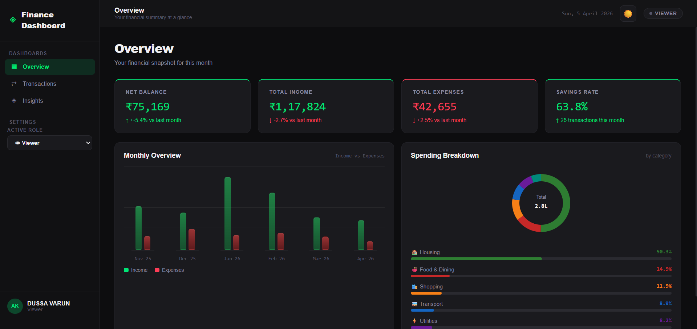
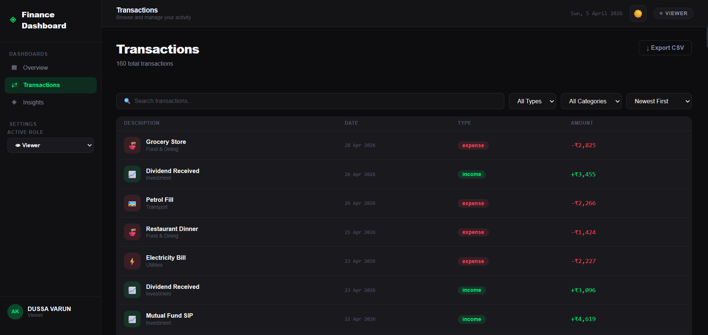
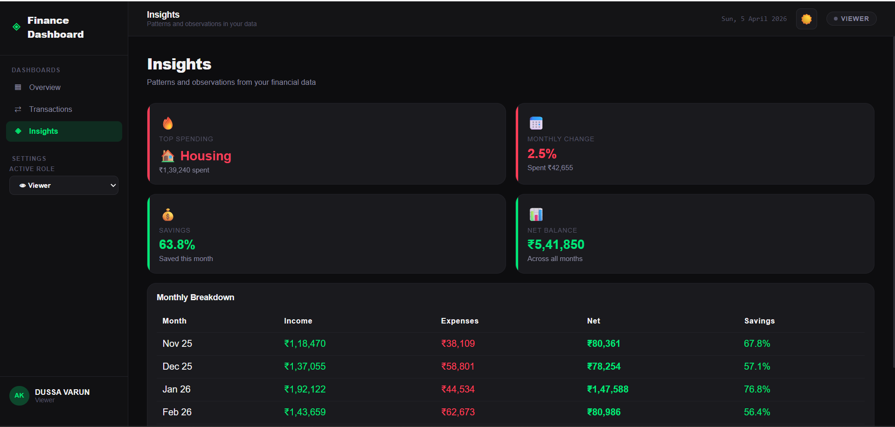

# 💰Personal Finance Dashboard

A modern, responsive personal finance dashboard built with **React + Vite** and **Tailwind CSS**.  
Designed for users to track income, expenses, and spending patterns through an intuitive dark-themed UI.

---

## 🌐 Live Demo

https://zorvynfinance.netlify.app/

---

## 📸 Screenshots

### Dashboard


### Transactions


### Insights


---

## ✨ Features

### 📊 Dashboard Overview
- Summary cards: **Net Balance**, **Total Income**, **Total Expenses**, **Savings Rate**
- Month-over-month percentage change on each card
- **Monthly Overview** bar chart — 6-month income vs expense comparison
- **Spending Breakdown** donut chart — category-wise expense distribution

### 💳 Transactions
- Full transaction list with **Description**, **Date**, **Category**, **Type**, and **Amount**
- **Search** transactions by description in real time
- **Filter** by type (Income / Expense) and by category (10 categories)
- **Sort** by: Newest First, Oldest First, Highest Amount, Lowest Amount
- **Add** new transactions via modal (Admin only)
- **Edit** and **Delete** existing transactions (Admin only)
- **Export CSV** — download all transactions as a CSV file

### 🔐 Role-Based UI
- **Admin** — full access: add, edit, delete transactions
- **Viewer** — read-only access, action buttons hidden
- Switch roles via dropdown in the sidebar — no backend required

### 💡 Insights
- Highest spending category highlighted
- Monthly income vs expense comparison
- Savings trend and spending pattern observations

### 🌙 Dark / Light Mode
- Toggle between dark and light themes from the header
- Managed via a dedicated `ThemeContext`

### ⚙️ State Management
- Global state via **React Context API**
- `AppContext` — transactions, filters, active role
- `ThemeContext` — dark/light mode preference

---

## 🛠️ Tech Stack

| Technology | Purpose |
|---|---|
| React 18 | UI library |
| Vite | Build tool & dev server |
| Tailwind CSS | Utility-first styling |
| Context API | Global state management |
| CSS Variables | Theming (dark/light) |

---
## 📁 Project Structure

```
src/
│
├── assets/                 # Static assets
│   ├── hero.png
│   ├── image.png
│   ├── react.svg
│   └── vite.svg
│
├── components/
│   ├── dashboard/
│   │   ├── BalanceTrend.jsx        # 6-month income vs expense chart
│   │   ├── SpendingBreakdown.jsx   # Donut chart
│   │   ├── SummaryCards.jsx        # KPI cards
│   │   └── SummaryCard.css
│   │
│   ├── insights/
│   │   └── InsightsPanel.jsx
│   │
│   ├── layout/
│   │   ├── Sidebar.jsx
│   │   ├── Sidebar.css
│   │   ├── Topbar.jsx
│   │   └── Topbar.css
│   │
│   └── transactions/
│       ├── AddTransactionModal.jsx
│       ├── TransactionFilters.jsx
│       ├── TransactionList.jsx
│       └── TransactionRow.jsx
│
├── context/
│   ├── AppContext.jsx
│   └── ThemeContext.jsx
│
├── data/
│   └── mockData.js
│
├── pages/
│   ├── Dashboard.jsx
│   ├── Transactions.jsx
│   └── Insights.jsx
│
├── utils/
│   └── helpers.js
│
├── App.jsx
├── App.css
├── main.jsx
└── index.css
```


---

## 🚀 Getting Started

### Prerequisites
- Node.js >= 18
- npm

### Installation
```bash
git clone https://github.com/Dussavarun/Finance_Dashboard.git
cd Finance_Dashboard
npm install
npm run dev
```

Open [http://localhost:5173](http://localhost:5173) in your browser.

### Build for Production
```bash
npm run build
npm run preview
```

---

## 📦 Scripts

| Script | Description |
|---|---|
| `npm run dev` | Start development server |
| `npm run build` | Build for production |
| `npm run preview` | Preview production build |
| `npm run lint` | Run ESLint |

---

## 🎨 Design Decisions

- **CSS Variables + Tailwind** — all colors defined as CSS variables enabling clean dark/light mode switching via `ThemeContext`
- **Two Contexts** — `AppContext` handles data and role logic; `ThemeContext` is isolated so theme changes don't re-render the whole tree
- **Component-per-concern** — each UI piece (row, modal, filters) is its own file, making the codebase easy to navigate and extend
- **Mock data generator** — produces realistic Indian-locale (₹) transactions across 6 months with natural variation per entry
- **Role simulation on frontend** — roles stored in Context and checked per component; no backend required per assignment scope
- **CSV Export** — implemented using plain JavaScript `Blob` + anchor download, zero external dependencies

---

## 🙋 Author

**Dussa Varun**  
[GitHub](https://github.com/Dussavarun)